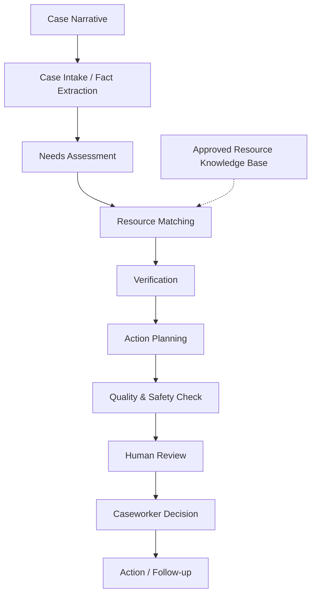

# MigrantAid — Case-to-Action Assistant

> **"Case-to-action assistant for supporting migrant workers"**

MigrantAid is an evidence-backed, human-in-the-loop assistant for community workers and NGO caseworkers supporting migrant workers. It turns an incomplete, messy natural-language description of a migrant worker's situation into a structured, evidence-backed, human-reviewable action plan.

It is designed as an **assistive workflow**, not an autonomous authority. MigrantAid does not grant benefits, approve or reject applications, give legal decisions, or guarantee eligibility. A qualified human caseworker remains responsible for all consequential decisions.

---

## 1. Project Overview

MigrantAid helps a frontline community worker move a case from raw narrative to a concrete, sequential set of actions that can actually be taken.

### What MigrantAid does

- Reads a free-form case narrative (e.g. *"A worker in Pune lost his job and has two children…"*).
- Extracts structured facts with provenance (`explicit`, `inferred`, `unknown`, `conflicting`).
- Identifies and prioritizes the beneficiary's needs.
- Matches those needs against a controlled, approved resource knowledge base.
- Verifies each match against case evidence using deterministic rules.
- Produces a sequential, prioritized action plan for the caseworker.
- Runs a quality/safety audit before anything is presented.
- Stops at a human review checkpoint for a caseworker decision.

### Target users

Frontline community workers, NGO caseworkers, and migrant resource center staff who support migrant workers but are not expected to be domain experts on every available service.

### The problem being addressed

Messy, incomplete case descriptions cause important facts to be missed, wrong resources to be reached for, and unsupported claims to be passed along. MigrantAid addresses this by structuring the work into specialized stages, each justified by a specific failure mode, and by keeping every recommendation grounded in visible evidence.

### Why evidence-backed recommendations are important

Every recommendation must be traceable to a case fact and a resource requirement. MigrantAid does not fabricate resources or source citations, and it never presents a plausible-but-unsupported claim as fact. This is enforced by a deterministic verification engine rather than relying on the model as the sole source of truth.

### Why human review is important

The system prepares and verifies information, but it does **not** decide. Unknown eligibility is never silently converted into eligible, contradictions remain visible, and missing information stays explicit. A human caseworker reviews everything, can approve, modify, request information, or reject, and ultimately owns the decision on whether to progress a referral.

### The Case-to-Action concept

"Case-to-action" is the central design idea: a case should not stop at an analysis or a list of resources. It should end with a clear, sequential, human-approved set of actions the caseworker can follow. MigrantAid carries the case from intake all the way through analysis, matching, verification, action planning, quality/safety checking, and human review.

---

## 2. Key Features

The following features are implemented and verified in the codebase.

- **Case intake** — Submit a free-form natural-language case narrative (with optional pre-loaded sample cases); the original input is preserved.
- **Structured fact extraction** — Extract structured facts with provenance status (`explicit`, `inferred`, `unknown`, `conflicting`), using an LLM with a deterministic heuristic fallback.
- **Needs assessment** — Identify, categorize, and prioritize beneficiary needs using a controlled `NeedCategory` vocabulary (`basic_support`, `employment`, `housing`, `documentation`, `education`, `financial_assistance`, etc.).
- **Resource matching** — Retrieve candidate resources from an approved knowledge base by category and evaluate them against case facts.
- **Evidence / eligibility verification** — A deterministic `VerificationEngine` checks every resource requirement against case evidence, enforcing `UNKNOWN != SATISFIED` and flagging conflicts.
- **Sequential action planning** — Generate a prioritized, step-by-step action plan grounded in contradictions, missing information, and verified matches.
- **Quality & safety check** — A pre-presentation audit that surfaces unsupported claims, missing evidence, and unresolved contradictions.
- **Human review checkpoint** — A caseworker decision gate with `Approve` / `Modify` / `Request Information` / `Reject`, plus reviewer notes.
- **Contradiction handling** — Conflicting facts are detected upstream and surfaced, never silently resolved.
- **Missing-information handling** — Fields that could not be determined are tracked as `missing_information` and carried into the action plan as explicit next steps.
- **Grounded rules** — Evidence before recommendation: every recommendation carries `EvidenceItem`s linking case facts to resource requirements, and a `strong_match` requires at least one satisfied evidence item.
- **Trajectory / traceability** — A full execution trajectory of `AgentEvent`s is recorded and persisted, and surfaced in the UI as a "Trajectory" view.

---

## 3. System Architecture

MigrantAid is an **agentic workflow**, not a single chatbot. An explicit Python orchestrator (`CaseOrchestrator`) controls the sequence and state transitions, and each agent returns validated, typed Pydantic objects.

### Major components

| Component | Responsibility |
|---|---|
| **Web / UI layer** | Next.js + React + TypeScript frontend for intake, review, recommendations, verification, human review, and trajectory. |
| **API / application layer** | FastAPI REST API that validates requests, invokes the orchestrator, and exposes results. |
| **Case orchestrator** | Controls the multi-stage pipeline and records a complete `AgentEvent` trajectory. |
| **Intake Agent** | Turns messy narratives into structured `CaseProfile` facts (LLM-assisted with heuristic fallback). |
| **Needs Assessment Agent** | Produces a categorized, prioritized `NeedsAssessment`. |
| **Matching Agent** | Retrieves candidates from the resource knowledge base and integrates the verification engine. |
| **Verification Engine** | Deterministic rule-based evaluation of resource requirements against case evidence. |
| **Action Planning Agent** | Produces a sequential `ActionPlan`. |
| **Quality / Safety Agent** | Audits output before presentation and enforces the human-review gate. |
| **Resource Knowledge Base** | Controlled, approved dataset of resources (`data/resources.json`) with source metadata (`data/sources.json`). |
| **Case memory / state** | In-memory state with optional PostgreSQL persistence (`CaseState` aggregate). |

### How a case moves through the system

1. **Case Intake** — The caseworker submits a narrative; the Intake Agent extracts facts, missing information, and contradictions into a `CaseProfile`.
2. **Needs Assessment** — The Needs Agent prioritizes needs from the profile.
3. **Matching & Verification** — The Matching Agent retrieves candidate resources and the deterministic Verification Engine evaluates each requirement against the case facts.
4. **Action Planning** — The Action Planner orders sequential steps addressing contradictions, missing info, and verified referrals.
5. **Quality & Safety Check** — The Quality Agent audits evidence backing and safety.
6. **Human Review** — The case is presented to the caseworker, who makes the final decision.
7. **Final packet / trajectory** — The complete `CaseState` — including the decision and full trajectory — is available for review.

---

## 4. End-to-End Case-to-Action Flow



The pipeline stages above map directly to the implemented `CaseOrchestrator` stages: `intake`, `needs_assessment`, `matching_and_verification`, `action_planning`, `quality_check`, and `human_review`. The final `CaseState` also carries a full execution trajectory (see `Traces.md`).

---

## 5. Tech Stack

| Layer | Technology |
|---|---|
| **Frontend** | Next.js 14 (Pages Router), React 18, TypeScript |
| **Styling** | Tailwind CSS 3.4 |
| **Icons / UI** | lucide-react, clsx, tailwind-merge |
| **Backend** | Python, FastAPI, Uvicorn |
| **Data validation** | Pydantic v2 (typed domain schemas) |
| **AI / LLM** | Google Gen AI SDK (`google-genai`) — Gemini, configured via environment variables |
| **Database** | Prisma (PostgreSQL) via `psycopg` (psycopg3) + `psycopg_pool` connection pooling |
| **Config / env** | `python-dotenv` (`.env`) |
| **Testing** | pytest, pytest-asyncio, httpx |
| **Linting / formatting** | ruff |
| **Tooling** | npm (Node.js), Git |

---

## 6. Project Structure

```text
migrantaid/
│
├── README.md
├── .env.example
├── .gitignore
│
├── backend/
│   ├── app/
│   │   ├── main.py              # FastAPI app, CORS, exception handling
│   │   ├── config.py            # Settings from environment variables
│   │   ├── api/routes.py        # REST API endpoints
│   │   ├── agents/              # Intake, Needs, Matching, Action Planner, Quality, Orchestrator
│   │   ├── schemas/domain.py    # Typed Pydantic domain schemas
│   │   ├── services/            # Case workflow, verification engine, resource KB, evaluator
│   │   └── db/                  # Connection pool, repository, migrations
│   ├── tests/                   # pytest suite
│   └── requirements.txt
│
├── frontend/
│   ├── src/
│   │   ├── pages/               # index.tsx (single-page workflow)
│   │   ├── components/          # IntakeView, FactsView, NeedsView, RecommendationsView,
│   │   │                        # ActionPlanView, HumanReviewView, TrajectoryView, BenchmarkDashboard, ui/
│   │   ├── lib/                 # api.ts, workflow.ts, status.tsx, useTheme.ts
│   │   └── types/               # TypeScript interfaces mirroring backend schemas
│   ├── public/                  # icon.png, favicon.ico
│   └── package.json
│
├── baseline/                    # Baseline single-prompt system and results
├── evaluation/                  # Evaluation runners, scoring, and reports
├── data/                        # resources.json, sources.json, evaluation_cases.json
├── trajectories/                # agent_trajectories.json
└── scripts/                     # validate_environment.py, validate_data.py
```

**Purpose of major directories:**

- **`backend/app`** — The FastAPI application: agents, orchestrator, domain schemas, services, and database layer.
- **`frontend/src`** — The Next.js single-page caseworker workflow UI.
- **`baseline` / `evaluation`** — The comparison baseline, evaluation runners, scorer, and reports.
- **`data`** — The controlled resource knowledge base, source metadata, and evaluation cases.
- **`trajectories`** — Captured agent execution trajectories.
- **`scripts`** — Environment and data validation utilities.

---

## 7. AI / Gemini Integration

MigrantAid uses the **new Google Gen AI SDK** (`google-genai`). The Intake Agent calls the Gemini model to interpret the messy narrative and extract structured case facts.

Key points:

- The model and API key are **configured through environment variables** (`LLM_API_KEY`, `LLM_MODEL`); they are never hard-coded or committed.
- The Intake Agent sends a structured prompt and requests JSON output via `client.models.generate_content(...)` with `response_mime_type="application/json"`.
- If no API key is configured, or the LLM call fails, the Intake Agent falls back to a **deterministic, high-precision heuristic extractor**, so the workflow remains fully functional without a live API key.
- The remaining pipeline stages (needs, matching, verification, action planning, quality) operate on structured data and use **deterministic business logic**, keeping the LLM focused on interpretation and synthesis rather than being the sole source of truth.

> **Security note:** Never commit real API keys. Provide them only through the local `.env` file (see `.env.example`), and never expose the actual `.env` values.

---

## 8. Database

The backend integrates **PostgreSQL** for persistent case state, using `psycopg` (psycopg3) and `psycopg_pool` for connection pooling.

- The pool is initialized with health checks, a minimum of 1 and maximum of 10 connections, and bounded retry logic for transient connection or stale-pool failures.
- The `CaseRepository` persists the full `CaseState` transactionally across tables: `cases`, `case_facts`, `case_needs`, `resource_recommendations`, `verification_results`, `action_plan_items`, `human_reviews`, and `trajectory_events`.
- If `DATABASE_URL` is **not** configured, the service safely falls back to in-memory case state, so the app runs without a database for local/demo use.

> **Security note:** Credentials come from the `DATABASE_URL` / `DIRECT_URL` environment variables and are never exposed in code or committed.

---

## 9. Installation & Setup

### Prerequisites

- **Python 3.11+**
- **Node.js 20+**
- (Optional) A PostgreSQL instance for persistent storage; not required for in-memory demo mode.

### Installation

```powershell
# Backend dependencies
cd backend
python -m venv .venv
.\.venv\Scripts\activate
pip install -r requirements.txt

# Frontend dependencies
cd ..\frontend
npm install
```

### Environment variables

Copy `.env.example` to `.env` and fill in the values (see [Environment Variables](#10-environment-variables)). The app runs without a real API key or database URL (features gracefully fall back), but for full LLM extraction and persistence, provide them.

### Database setup (optional)

If you are using PostgreSQL, run the migration script to create the required tables:

```powershell
cd backend
.\.venv\Scripts\python .\scripts\run_migrations.py
```

### Validate the environment

```powershell
cd backend
.\.venv\Scripts\python ..\scripts\validate_environment.py
```

### Backend startup

```powershell
cd backend
.\.venv\Scripts\uvicorn app.main:app --reload --host 127.0.0.1 --port 8000
```

### Frontend startup

```powershell
cd frontend
npm run dev
```

### Application URL

Open the Caseworker Dashboard at **http://localhost:3000**.

The frontend proxies `/api/*` to `http://127.0.0.1:8000/api`, so ensure the backend is running first.

---

## 10. Environment Variables

The following environment variable **names** are used (provide your own values via `.env` — never commit real secrets). Example values are shown as placeholders.

```text
LLM_API_KEY=your_llm_api_key_here
LLM_MODEL=gemini-1.5-flash
DATABASE_URL=your_postgres_connection_string
DIRECT_URL=your_prisma_postgres_direct_connection_string
APP_ENV=development
NEXT_PUBLIC_API_URL=http://127.0.0.1:8000/api
```

> **Security note:** API keys, passwords, tokens, and connection strings must never be committed to the repository. Provide them only via the local `.env` file, which is ignored by Git.

---

## 11. How to Use

1. **Start the application** — Run the backend and frontend as described in [Installation & Setup](#9-installation--setup), then open http://localhost:3000.
2. **Enter or load a case** — Type a free-form case narrative, or load one of the pre-configured sample cases.
3. **Analyze the case** — Click **Analyze Case** to run the multi-stage pipeline.
4. **Review extracted facts** — Verify the structured facts and their provenance; you can edit any fact, which triggers automated re-verification.
5. **Review identified needs** — Review the prioritized needs and why each was identified.
6. **Review resource recommendations and evidence** — See matched resources, their match status, and the evidence linking case facts to requirements.
7. **Review verification results** — Inspect per-requirement evaluation results (`satisfied`, `not_satisfied`, `unknown`, `conflict`), warnings, and missing information.
8. **Review the sequential action plan** — Confirm the ordered steps for the caseworker.
9. **Complete the human review decision** — **Approve**, **Modify**, **Request Information**, or **Reject**, with optional reviewer notes.
10. **Inspect the trace / trajectory** — Open the **Trajectory** view to see how MigrantAid reached the result, stage by stage.

---

## 12. Human-in-the-Loop & Safety

- **AI assists, humans decide.** MigrantAid helps the caseworker prepare and verify information; it does not independently make the final eligibility or referral decision.
- **No silent conversions of unknown to eligible.** The deterministic verification engine enforces the invariant `UNKNOWN != SATISFIED` — a missing or unknown fact is never promoted to *satisfied*.
- **Contradictions remain visible.** Conflicting information is detected and surfaced as a `conflict` state and as a critical action-plan step, never silently resolved.
- **Missing information remains explicit.** Fields that could not be determined are tracked and carried through as explicit next steps.
- **Human review is part of the workflow.** Cases stop at a human review checkpoint, and only a caseworker decision progresses referrals — which approve *referral progression*, not a claim of guaranteed eligibility.
- **Grounded recommendations.** A recommendation classified as a strong match must have supporting evidence, and every recommendation carries traceable evidence references.

---

## 13. Testing

The backend test suite uses **pytest** (with `pytest-asyncio`) and covers schemas, agents, the verification engine, API routes, the database layer, baseline behavior, the evaluator, and the Gemini integration fallback.

To run all tests:

```powershell
cd backend
.\.venv\Scripts\python -m pytest        # or: pytest  (with the venv activated)
```

Test files live under `backend/tests/` and include:

- `test_schemas.py` — domain schema validation and invariants
- `test_verification_engine.py` — operator evaluations and engine invariants (e.g. unknown never promoted to satisfied)
- `test_agents.py` — agent behavior
- `test_api.py` — REST API endpoints
- `test_main.py` — application health and setup
- `test_database.py` — database/persistence behavior
- `test_baseline.py` — baseline runner
- `test_evaluator.py` — evaluation scoring
- `test_data_validation.py` — resource/source/evaluation data validation
- `test_gemini_integration.py` — Gemini fallback handling

For code quality, the project uses **ruff** for linting and formatting (see `backend/pyproject.toml` and `backend/requirements.txt`).

---

## 14. Limitations / Future Improvements

The following reflect the current implementation and realistic next steps; implemented behavior is confirmed in the codebase, while future items are clearly marked as future work.

### Current limitations

- **LLM usage is limited to intake.** Currently only the Intake Agent invokes the Gemini model; the rest of the pipeline is deterministic. This keeps behavior auditable but means needs, matching, and planning do not use semantic reasoning beyond structured rules.
- **Coordinate/refinement loop.** Editing facts in the UI triggers automated re-verification and re-planning, but the current pipeline is primarily one forward pass rather than an interactive multi-turn refinement loop.
- **Synthetic resource data.** The knowledge base is an approved, controlled dataset (synthetic/approved records for the demo), not a live, continuously-updated catalogue of real services.
- **No real benefit submission.** The prototype stops at the human review gate; external consequential actions are simulated only.

### Future work

- **Semantic retrieval & embeddings** for resource matching when the approved dataset grows.
- **Evidence-backed reviewer feedback capture** (why a caseworker changed or rejected a recommendation) to drive improvement experiments.
- **Document checklists and follow-up tracking** with simulated dates/status.
- **Evaluation dashboard** refreshing live results and per-case failure analysis.
- **Longitudinal case memory and multilingual input** for broader real-world use.

---

## 15. Acknowledgement

This project was developed as part of the Micro1 Frontier Challenge. I am grateful to Micro1 for providing this opportunity to work on a meaningful real-world problem and to build MigrantAid as part of the challenge.
