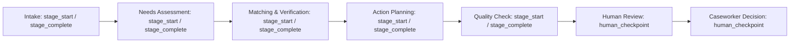

# MigrantAid — Traceability & Trajectory

This document describes MigrantAid's traceability / trajectory system, which records how a case moves through the assisted Case-to-Action pipeline and how a final recommendation was produced. It focuses specifically on the **observation and audit layer**, not on the pipeline itself (covered in `README.md`).

---

## 1. What the Trace / Trajectory View Is

Every time a case is processed, the `CaseOrchestrator` records a **trajectory**: an ordered list of structured `AgentEvent` objects describing each stage as it runs. This trajectory is stored on the case's `CaseState` (`trajectory: list[AgentEvent]`), persisted to the database, and surfaced in the frontend as the **Trajectory** view — titled *"How MigrantAid Reached This Result."*

In the UI, events are grouped by **(stage, agent)** into logical stage cards. Because each stage records both a `stage_start` and a `stage_complete` event for observability, the frontend groups them under a single expandable card so full auditability is preserved without visual duplication. Each card can be expanded to inspect the individual events — inputs, outputs, timing, and any errors.

---

## 2. Why Traceability Is Important in MigrantAid

MigrantAid is an evidence-backed, human-in-the-loop assistant. Because a human caseworker is responsible for consequential decisions, the system must be able to answer the question:

> *"Why was this recommendation produced?"*

Traceability makes the assistant's behavior **transparent**, **auditable**, and **debuggable**. It also supports human oversight: a caseworker can see exactly which stage produced a fact, a need, a match, a verification result, or a plan step, and can hold the system accountable rather than treating it as a black box.

---

## 3. What Stages / Events Are Recorded

The orchestrator records one or more events per pipeline stage. The implemented stages are:

| Stage | Agent / Component | What is recorded |
|---|---|---|
| `intake` | IntakeAgent | The narrative input and the extracted facts, missing fields, and contradictions produced. |
| `needs_assessment` | NeedsAssessmentAgent | The identified needs and their categories. |
| `matching_and_verification` | MatchingAgent / VerificationEngine | Retrieved and verified recommendations, with each match status. |
| `action_planning` | ActionPlanningAgent | The generated sequential action plan and its step count. |
| `quality_check` | QualityAgent | Whether the quality check passed, safe-to-present status, and any issues. |
| `human_review` | HumanReviewGate (then **Caseworker**) | The human checkpoint event and, after review, the caseworker's decision. |
| `human_fact_edit` | Caseworker | A caseworker's fact edits and the triggered re-verification. |

Each stage normally produces two observability events: `stage_start` (capturing the input) and `stage_complete` (capturing the output and latency). Other supported event types include `tool_call`, `tool_response`, `verification`, `retry`, `error`, and `human_checkpoint`.

---

## 4. What Information Is Captured for Each Stage

Each `AgentEvent` is a typed schema that captures the following fields (all verified in `backend/app/schemas/domain.py`):

| Field | Meaning |
|---|---|
| `stage` | Workflow stage name (e.g. `intake`, `matching_and_verification`). |
| `agent` | The agent or component that produced the event (e.g. `IntakeAgent`, `Caseworker`). |
| `event_type` | One of `stage_start`, `stage_complete`, `tool_call`, `tool_response`, `verification`, `retry`, `error`, `human_checkpoint`. |
| `input_summary` | Brief summary of the agent's input (does not log raw sensitive data). |
| `output_summary` | Brief summary of the agent's output. |
| `tool_call` | The tool invoked (if any). |
| `tool_response_summary` | Summary of a tool's response (if any). |
| `verification_result` | Verification outcome, when applicable. |
| `error_message` | Error details, when the event is an error. |
| `retry_count` | Number of retries (>= 0). |
| `latency_ms` | Stage latency in milliseconds. |
| `timestamp` | When the event was recorded. |
| `metadata` | Additional structured metadata (must not contain secrets or PII). |

### Evidence used

The trajectory is complemented by the case's structured evidence, which lives alongside it on `CaseState`:

- Each verified recommendation carries `EvidenceItem`s that link a `case_fact_id` to a `requirement_id`.
- Each resource requirement has a `RequirementEvaluation` (`satisfied`, `not_satisfied`, `unknown`, `conflict`) with an explanatory `evidence_text`.
- The `CaseProfile` records `facts`, `missing_information`, and `contradictions`.

This is how the trajectory's narrative events connect to the concrete evidence behind each recommendation.

### Human review events

Human interactions are recorded as `human_checkpoint` events:

- A review-checkpoint event is appended when the case is prepared and awaiting review.
- When the caseworker makes a decision (Approve / Modify / Request Information / Reject), an event records the decision and the reviewer's notes.
- A `human_fact_edit` event records when a caseworker corrects facts, which re-triggers downstream analysis.

---

## 5. Following a Case from Intake to Human Review

A complete trajectory follows the actual implemented flow:



By reading the trajectory in order, you can trace a case end-to-end:

1. **Intake** — How the messy narrative was turned into structured facts (and what was marked missing or conflicting).
2. **Needs Assessment** — Which needs were identified from those facts.
3. **Matching & Verification** — Which resources were retrieved and how each was verified against case evidence.
4. **Action Planning** — How the verified results became a sequential plan.
5. **Quality Check** — Whether the output was audited as safe to present.
6. **Human Review** — The checkpoint and the caseworker's final decision.

The grouped UI timeline shows the same journey, and each card expands to reveal the underlying events (input, output, latency). Combined with the per-requirement evidence, this gives a complete, auditable record of how the result was produced.

---

## 6. How Traces Support Transparency, Auditability, Debugging, and Human Oversight

- **Transparency** — The caseworker can see not just *what* was recommended, but *how* the system reached it: which facts, needs, requirements, and verifications contributed.
- **Auditability** — Every stage and event is timestamped and persisted (to `trajectory_events` in PostgreSQL and to in-memory state), producing a durable record that supports review and post-hoc analysis.
- **Debugging** — Because each stage records inputs, outputs, errors, retries, and latency, failures can be localized to the exact stage that caused them.
- **Human oversight** — The trajectory, together with contradictions, missing information, and the human review checkpoint, keeps a qualified caseworker in control. The recorded events make it possible to understand and challenge any recommendation before a consequential decision is made.

---

## 7. Example `AgentEvent`

An illustrative (non-sensitive) trajectory event in JSON form:

```json
{
  "case_id": "CASE-001",
  "stage": "intake",
  "agent": "IntakeAgent",
  "event_type": "stage_complete",
  "input_summary": "Case narrative (412 chars)",
  "output_summary": "Extracted 7 facts, 3 missing fields, 1 contradictions",
  "retry_count": 0,
  "latency_ms": 1280.5,
  "timestamp": "2026-08-31T10:20:03Z"
}
```

Structured trajectories are also captured for evaluation runs under `trajectories/` (e.g. `agent_trajectories.json`), keeping synthetic evaluation data separate from live case demonstrations.
